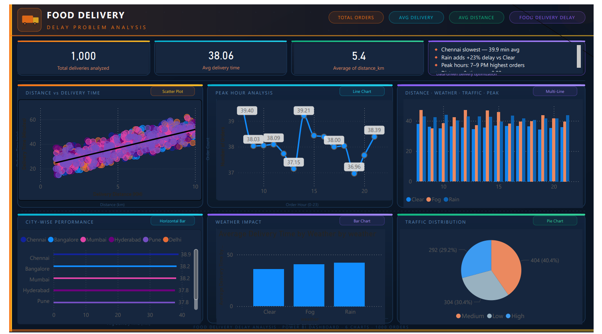

# 🚚 Food Delivery Delay Analysis Dashboard

## 📌 Project Overview

Food delivery platforms handle thousands of orders daily, and delivery delays directly impact customer satisfaction and operational efficiency. This project analyzes delivery performance using **SQL**, **Excel**, and **Power BI** to identify the key factors affecting delivery delays across 6 major Indian cities.

The dashboard focuses on understanding how **distance**, **traffic conditions**, **weather**, and **peak order hours** influence delivery time. The goal is to provide actionable insights that help delivery platforms optimize logistics and improve delivery efficiency.

---

## 🎯 Business Problem

Food delivery companies often face delays caused by multiple operational factors. Without proper analysis, it becomes difficult to identify:

* Which cities experience the highest delivery delays
* Whether distance significantly impacts delivery time
* How traffic and weather conditions affect delivery performance
* Which time of day experiences the highest order volume

This dashboard answers these questions using **data-driven insights** from 1000 real-world simulated orders.

---

## 🧰 Tools & Technologies Used

| Tool                 | Purpose                                          |
| -------------------- | ------------------------------------------------ |
| **SQL**              | Data extraction and preparation                  |
| **Excel**            | Dataset handling and preprocessing               |
| **Power BI Desktop** | Interactive dashboard creation and visualization |

---

## 📊 Dashboard Features

### 🔹 KPI Metrics

* **Total Orders Analyzed** — 1,000 deliveries
* **Average Delivery Time** — 38.1 minutes
* **Average Delivery Distance** — 5.4 km
* **Key Operational Insights** — City, weather and peak hour findings

### 🔹 Distance vs Delivery Time (Scatter Plot)

A scatter plot with a trend line confirming that delivery time increases as delivery distance increases. Strong positive correlation observed **(r = 0.82)**.

### 🔹 Peak Hour Analysis (Line Chart)

A line chart highlighting time periods with the highest order volume. Helps identify operational peak hours for better driver allocation.

### 🔹 City Performance Analysis (Bar Chart)

A horizontal bar chart comparing average delivery time across all 6 cities — Chennai, Bangalore, Mumbai, Hyderabad, Pune, and Delhi.

### 🔹 Weather Impact Analysis (Bar Chart)

A breakdown showing how weather conditions (Clear, Rain, Fog) influence average delivery time and delays.

### 🔹 Traffic Distribution (Pie Chart)

A pie chart showing the distribution of traffic levels (Low, Medium, High) across all deliveries.

### 🔹 Multi-Dimension Analysis (Multi-Line Chart)

A combined line chart analyzing Distance, Weather, Traffic, and Peak Hour patterns together for deeper insights.

---

## 📈 Key Insights

| # | Insight                                                                          |
| - | -------------------------------------------------------------------------------- |
| 1 | **Chennai** has the highest average delivery time — **39.9 min**                 |
| 2 | **Rain** increases delivery time by **~23%** compared to Clear weather           |
| 3 | **Peak order hours** are **7 PM – 9 PM**, indicating highest operational load    |
| 4 | Strong **distance-time correlation: r = 0.82** — longer distance = longer delay  |
| 5 | **High traffic** significantly increases delivery time vs Low traffic conditions |
| 6 | **Fog** also causes moderate delays compared to Clear weather                    |

---

## 📁 Dataset Information

The dataset contains **1,000 simulated food delivery orders** across **6 major Indian cities**.

| Column                 | Description                                                        |
| ---------------------- | ------------------------------------------------------------------ |
| `order_id`             | Unique order identifier                                            |
| `city`                 | Delivery city (Chennai, Bangalore, Mumbai, Hyderabad, Pune, Delhi) |
| `distance_km`          | Delivery distance in kilometers                                    |
| `delivery_time_min`    | Total delivery time in minutes                                     |
| `traffic_level`        | Traffic condition (Low / Medium / High)                            |
| `weather`              | Weather condition (Clear / Rain / Fog)                             |
| `Order Hour`           | Hour of the day when order was placed (0–23)                       |
| `restaurant_prep_time` | Food preparation time at restaurant                                |
| `rider_id`             | Unique rider identifier                                            |
| `order_time`           | Timestamp of order placement                                       |

---

## 📷 Dashboard Preview



> *Dashboard built using Power BI Desktop with dark professional theme*

---

## 💡 Potential Business Impact

Insights from this dashboard can help delivery platforms:

* ✅ Optimize **delivery route planning** based on distance analysis
* ✅ Improve **driver allocation** during peak hours (7–9 PM)
* ✅ Prepare for **weather-related delivery delays** (Rain/Fog)
* ✅ Reduce **customer complaints** related to late deliveries
* ✅ Identify **underperforming cities** for targeted improvement
* ✅ Plan **surge pricing** during high-traffic and peak-hour windows

---

## 📂 Project Structure

```
food-delivery-delay-analysis/
│
├── README.md                                   # Project documentation
├── analysis_queries.sql                         # SQL queries used for analysis
├── dashboard_preview.png                        # Power BI dashboard preview
├── food_delivery_data.csv                       # Dataset used in the project
├── food_delivery_delay_analysis_dashboard.pbix  # Power BI dashboard file
└── food_delivery_delay_analysis_dashboard.pdf   # Exported dashboard report
```

---

## ▶️ How to Use This Project

1. **Clone the repository**

```
https://github.com/pratyaksha123-kumar/food-delivery-delay-analysis
```

2. Open `food_delivery_data.csv` in **Excel** to explore raw data
3. Open `food_delivery_delay_analysis_dashboard.pbix` in **Power BI Desktop** to interact with the dashboard
4. View `food_delivery_delay_analysis_dashboard.pdf` for quick preview without Power BI

---

## 🚀 Future Improvements

* [ ] Add **real-time delivery tracking** data integration
* [ ] Implement **predictive delivery time modeling** using ML
* [ ] Add **city-wise route optimization** analysis
* [ ] Integrate **customer satisfaction scores** with delay data
* [ ] Build **automated alerts** for peak hour surges

---

## 👤 Author

**Pratyaksha Kumar**
*Aspiring Data Analyst*

📧 Email: [pratyakshkumar35@gmail.com](mailto:pratyakshkumar35@gmail.com)
📞 Phone: +91 9105845288

🔗 LinkedIn:
https://www.linkedin.com/in/pratyaksha-kumar-26b4ab348/

🔗 GitHub:
https://github.com/pratyaksha123-kumar

**Skills:** SQL | Excel | Power BI | Data Visualization | DAX

---

⭐ If you found this project useful, please give it a star on GitHub!
